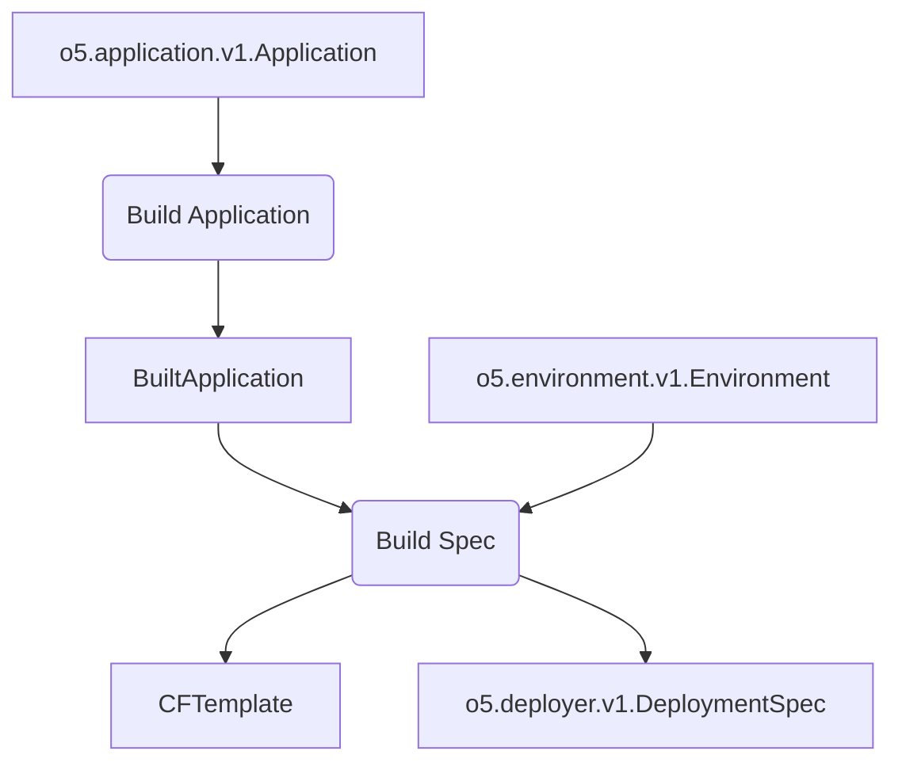
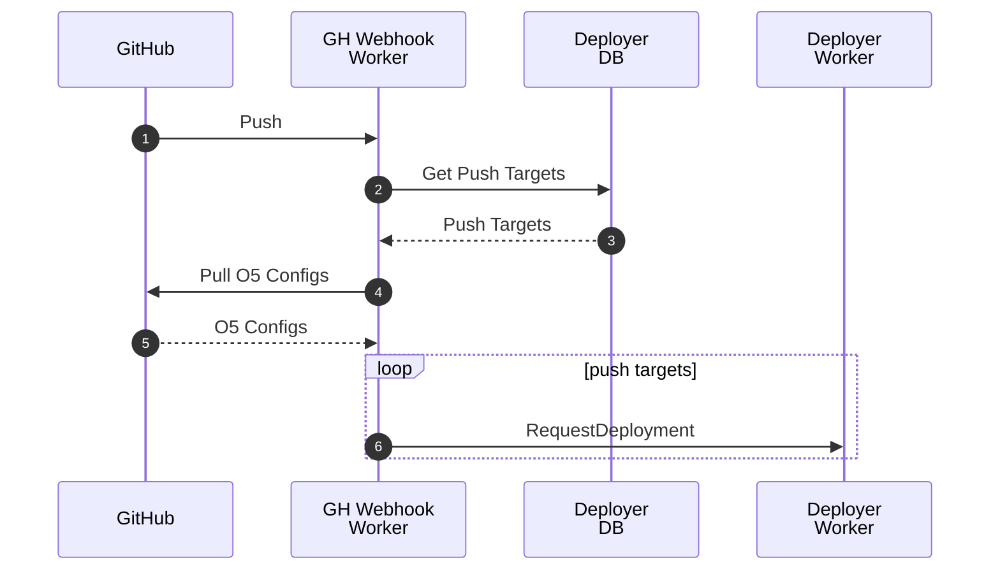
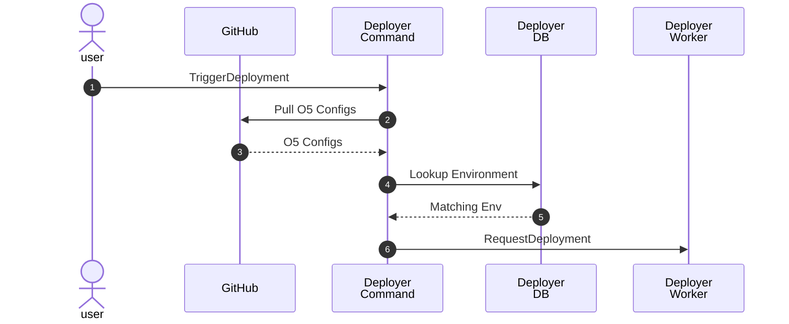
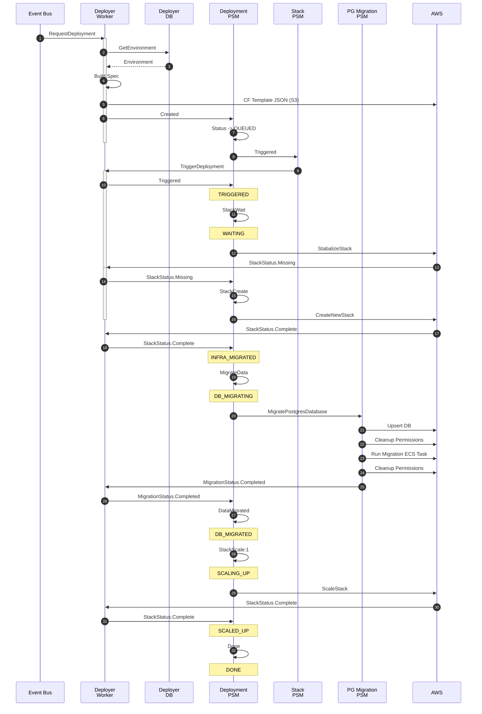
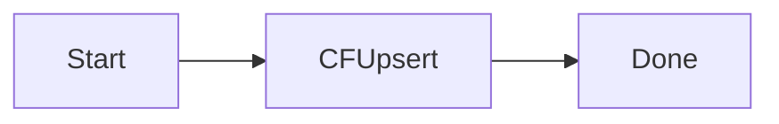
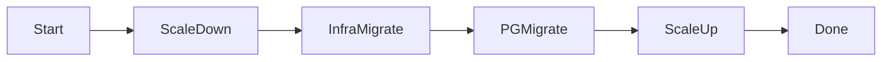
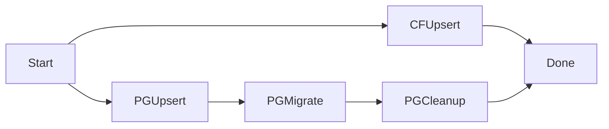
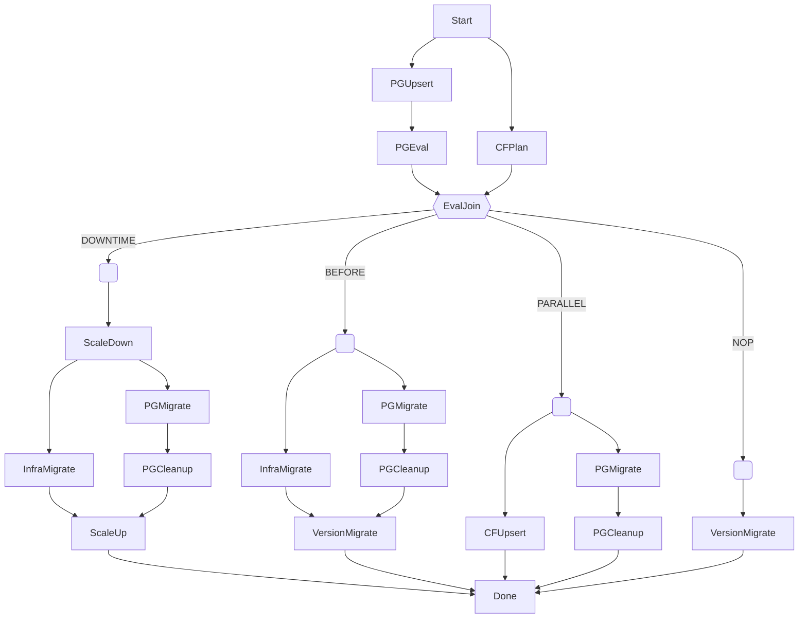

Deployer
========

## Stack State

```mermaid
stateDiagram-v2
    classDef auto fill:#002222,stroke-dasharray:4
	classDef failed stroke:red,fill:#330000

	[*] --> CREATING : Triggered
	CREATING --> CREATING : Triggered<br>(Adds to the queue)
	CREATING --> STABLE : DeploymentCompleted
	state stable <<choice>>
	STABLE:::auto --> stable
	stable --> AVAILABLE : Nothing Queued
	stable --> MIGRATING : Pops from queue
	AVAILABLE --> MIGRATING : Triggered<br>(External)
	MIGRATING --> STABLE : DeploymentCompleted
	MIGRATING --> MIGRATING : Triggered<br>(Adds to the queue)
	CREATING --> BROKEN:::failed : DeploymentFailed
	MIGRATING --> BROKEN : DeploymentFailed
```

## Deployment State

```mermaid
stateDiagram-v2
    classDef auto fill:#002222,stroke-dasharray:4
	classDef failed stroke:red,fill:#330000

    [*] --> QUEUED : Requested
	QUEUED --> TRIGGERED : Triggered
    TRIGGERED:::auto --> WAITING : StackWait

    WAITING --> WAITING : StackStatus.Progress
	FAILED_1:::failed : FAILED
    WAITING --> FAILED_1:::failed : Stack Failure
    WAITING --> AVAILABLE : StackStatus.Complete<br>StackStatus.Missing<br>StackStatus.Terminal (rolled back)
	AVAILABLE --> RUNNING : Running
	state stepStatus <<choice>>
	RUNNING --> stepStatus : StepStatus
	stepStatus --> RUNNING : Any Running
	state noRunning <<choice>>
	stepStatus --> noRunning : All Stopped
	noRunning --> FAILED_1 : Any Error
	noRunning --> DONE : All OK
```

## Database Deriving

# Sequences

## Github Trigger

## Manual Trigger

## Deployment

# Deployment Plans

## Current

Current state of the code, does not evaluate, and quick is sequential.

### Quick

When 'quick' is set on deployer, does not support DB migration

### Full

## Future / Plan

### Quick

When 'quick' is set on deployer, everything runs in parallel

### Full

Once evaluations are built in, the plan will depend on deployment config as well
as the current state of the infra.

