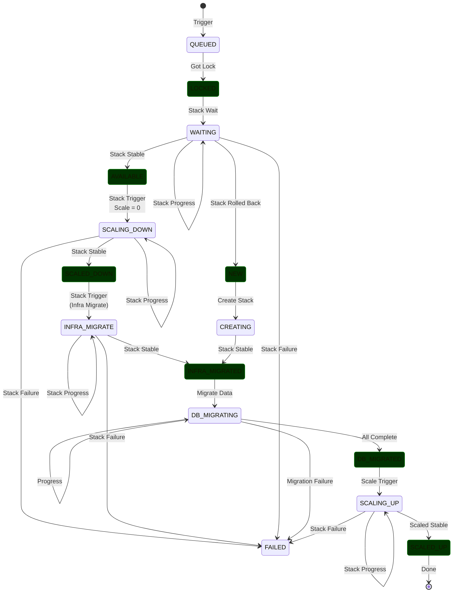

Deployer
========

```mermaid
stateDiagram-v2
    classDef auto stroke:green,fill:#003300

    [*] --> QUEUED : Trigger
    QUEUED --> LOCKED: Got Lock
    LOCKED:::auto --> WAITING : Stack Wait

    WAITING --> WAITING : Stack Progress
    WAITING --> AVAILABLE : Stack Stable


    AVAILABLE:::auto --> SCALING_DOWN : Stack Trigger<br>Scale = 0

    SCALING_DOWN --> SCALING_DOWN : Stack Progress
    SCALING_DOWN --> SCALED_DOWN : Stack Stable
    SCALING_DOWN --> FAILED : Stack Failure

    SCALED_DOWN:::auto --> INFRA_MIGRATE : Stack Trigger<br>(Infra Migrate)


    INFRA_MIGRATE --> INFRA_MIGRATE : Stack Progress
    INFRA_MIGRATE --> INFRA_MIGRATED : Stack Stable
    INFRA_MIGRATE --> FAILED : Stack Failure

    WAITING --> NEW : Stack Rolled Back
    WAITING --> FAILED : Stack Failure
    NEW:::auto --> CREATING : Create Stack
    CREATING --> INFRA_MIGRATED : Stack Stable


    INFRA_MIGRATED:::auto --> DB_MIGRATING : Migrate Data

    DB_MIGRATING --> FAILED : Migration Failure

    DB_MIGRATING --> DB_MIGRATING : Progress
    DB_MIGRATING --> DB_MIGRATED : All Complete


    DB_MIGRATED:::auto --> SCALING_UP : Scale Trigger

    SCALING_UP --> SCALING_UP : Stack Progress
    SCALING_UP --> SCALED_UP : Scaled Stable
    SCALING_UP --> FAILED : Stack Failure

    SCALED_UP:::auto --> [*] : Done

```
