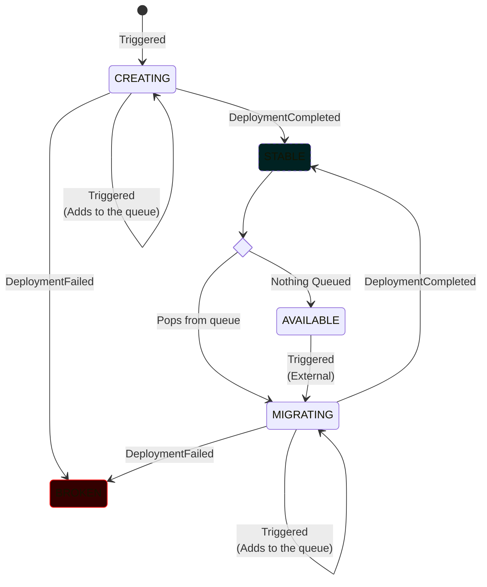
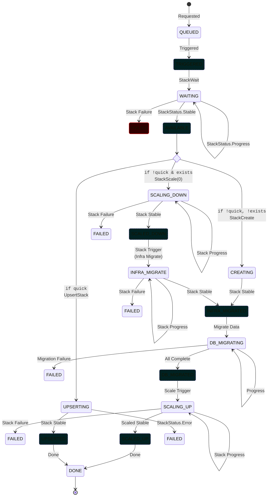
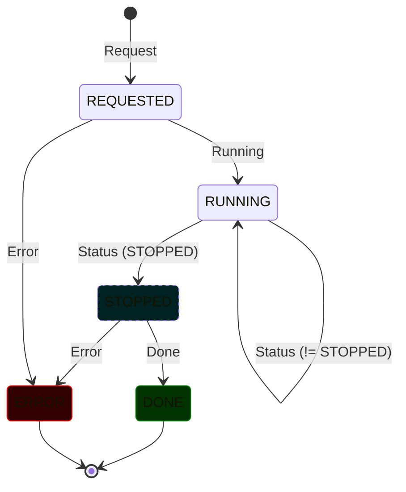
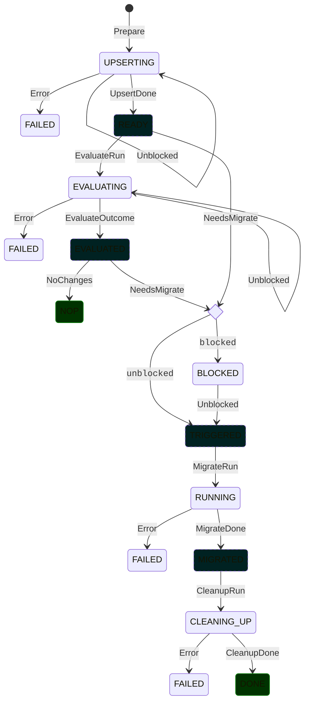

Deployer
========

## Stack State

```mermaid
stateDiagram-v2
    classDef auto fill:#002222,stroke-dasharray:4
	classDef failed stroke:red,fill:#330000

	[*] --> CREATING : Triggered
	CREATING --> CREATING : Triggered<br>(Adds to the queue)
	CREATING --> STABLE : DeploymentCompleted
	state stable <<choice>>
	STABLE:::auto --> stable
	stable --> AVAILABLE : Nothing Queued
	stable --> MIGRATING : Pops from queue
	AVAILABLE --> MIGRATING : Triggered<br>(External)
	MIGRATING --> STABLE : DeploymentCompleted
	MIGRATING --> MIGRATING : Triggered<br>(Adds to the queue)
	CREATING --> BROKEN:::failed : DeploymentFailed
	MIGRATING --> BROKEN : DeploymentFailed
```

## Deployment State

```mermaid
stateDiagram-v2
    classDef auto fill:#002222,stroke-dasharray:4
	classDef failed stroke:red,fill:#330000

    [*] --> QUEUED : Requested
	QUEUED --> TRIGGERED : Triggered
    TRIGGERED:::auto --> WAITING : StackWait

    WAITING --> WAITING : StackStatus.Progress
	FAILED_1:::failed : FAILED
    WAITING --> FAILED_1:::failed : Stack Failure
    WAITING --> AVAILABLE : StackStatus.Stable

	state available <<choice>>
	AVAILABLE:::auto --> available
	available --> SCALING_DOWN : <code>if !quick & exists</code><br>StackScale(0)
	available --> UPSERTING : <code>if quick</code><br>UpsertStack
	available --> CREATING : <code>if !quick, !exists</code><br>StackCreate

	CREATING --> INFRA_MIGRATED : Stack Stable


    SCALING_DOWN --> SCALING_DOWN : Stack Progress
    SCALING_DOWN --> SCALED_DOWN : Stack Stable
	FAILED_2:::failed : FAILED
    SCALING_DOWN --> FAILED_2 : Stack Failure

    SCALED_DOWN:::auto --> INFRA_MIGRATE : Stack Trigger<br>(Infra Migrate)

    INFRA_MIGRATE --> INFRA_MIGRATE : Stack Progress
    INFRA_MIGRATE --> INFRA_MIGRATED : Stack Stable
	FAILED_4:::failed : FAILED
    INFRA_MIGRATE --> FAILED_4 : Stack Failure

    INFRA_MIGRATED:::auto --> DB_MIGRATING : Migrate Data

	FAILED_3:::failed : FAILED
    DB_MIGRATING --> FAILED_3 : Migration Failure

    DB_MIGRATING --> DB_MIGRATING : Progress
    DB_MIGRATING --> DB_MIGRATED : All Complete


    DB_MIGRATED:::auto --> SCALING_UP : Scale Trigger

    SCALING_UP --> SCALING_UP : Stack Progress
	FAILED_5:::failed : FAILED
    SCALING_UP --> SCALED_UP : Scaled Stable
    SCALING_UP --> FAILED_5 : Stack Failure

    SCALED_UP:::auto --> DONE : Done
	UPSERTING --> UPSERTED : Stack Stable
	UPSERTED:::auto --> DONE : Done
	UPSERTING_FAILED:::failed : FAILED
	UPSERTING --> UPSERTING_FAILED : StackStatus.Error
	DONE --> [*]

```

## ECS Task State

```mermaid
stateDiagram-v2
    classDef auto fill:#002222,stroke-dasharray:4
	classDef failed stroke:red,fill:#330000
	classDef end stroke:green,fill:#003300

    [*] --> REQUESTED : Request
	REQUESTED --> RUNNING : Running
	RUNNING --> RUNNING : Status (!= STOPPED)
	RUNNING --> STOPPED : Status (STOPPED)
	STOPPED:::auto --> DONE : Done
	STOPPED --> ERROR : Error
	REQUESTED --> ERROR : Error
	DONE:::end --> [*]
	ERROR:::failed --> [*]

```

## Postgres Migration State

```mermaid
stateDiagram-v2
    classDef auto fill:#002222,stroke-dasharray:4
	classDef failed stroke:red,fill:#330000
	classDef end stroke:green,fill:#003300

    [*] --> UPSERTING : Prepare
	UPSERTING --> UPSERTING : Unblocked

	FAILED_1:::failed : FAILED
	UPSERTING --> FAILED_1 : Error

	UPSERTING --> READY : UpsertDone


	READY:::auto --> EVALUATING : EvaluateRun

	FAILED_0:::failed : FAILED
	EVALUATING --> FAILED_0 : Error

	EVALUATING --> EVALUATED : EvaluateOutcome
	EVALUATED:::auto --> NOP:::end : NoChanges
	EVALUATING --> EVALUATING : Unblocked


	state needsMigrate <<choice>>
	EVALUATED:::auto --> needsMigrate : NeedsMigrate
	READY --> needsMigrate : NeedsMigrate
	needsMigrate --> BLOCKED : <code>blocked</code>
	needsMigrate --> TRIGGERED : <code>unblocked</code>
	BLOCKED --> TRIGGERED : Unblocked


	TRIGGERED:::auto --> RUNNING : MigrateRun

	FAILED_2:::failed : FAILED
	RUNNING --> FAILED_2 : Error
	RUNNING --> MIGRATED : MigrateDone
	MIGRATED:::auto --> CLEANING_UP : CleanupRun

	FAILED_3:::failed : FAILED
	CLEANING_UP --> FAILED_3 : Error
	CLEANING_UP --> DONE:::end : CleanupDone


```
