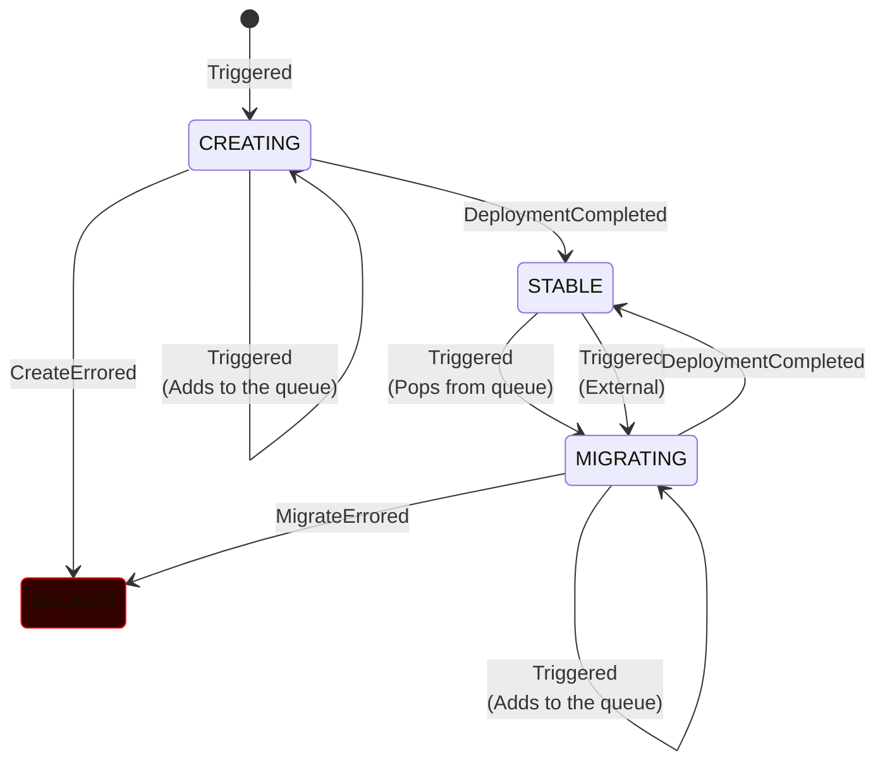
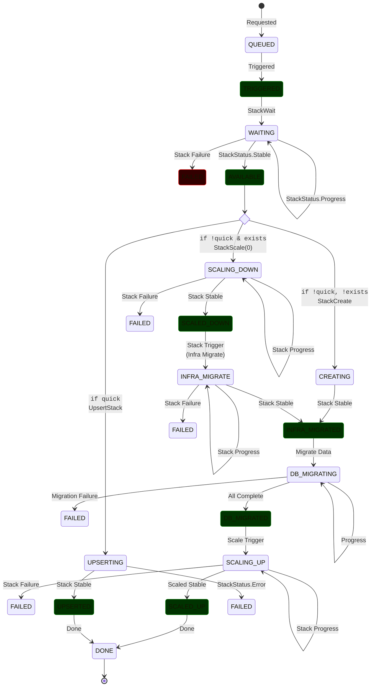

Deployer
========

## Stack State

```mermaid
stateDiagram-v2
	classDef error stroke:red,fill:#330000

	[*] --> CREATING : Triggered
	CREATING --> CREATING : Triggered<br>(Adds to the queue)
	CREATING --> STABLE : DeploymentCompleted
	STABLE --> MIGRATING : Triggered<br>(Pops from queue)
	STABLE --> MIGRATING : Triggered<br>(External)
	MIGRATING --> STABLE : DeploymentCompleted
	MIGRATING --> MIGRATING : Triggered<br>(Adds to the queue)
	CREATING --> BROKEN:::error : CreateErrored
	MIGRATING --> BROKEN : MigrateErrored
```

## Deployment State

```mermaid
stateDiagram-v2
    classDef auto stroke:green,fill:#003300
	classDef failed stroke:red,fill:#330000

    [*] --> QUEUED : Requested
	QUEUED --> TRIGGERED : Triggered
    TRIGGERED:::auto --> WAITING : StackWait

    WAITING --> WAITING : StackStatus.Progress
	FAILED_1:::failed : FAILED
    WAITING --> FAILED_1:::failed : Stack Failure
    WAITING --> AVAILABLE : StackStatus.Stable

	state available <<choice>>
	AVAILABLE:::auto --> available
	available --> SCALING_DOWN : <code>if !quick & exists</code><br>StackScale(0)
	available --> UPSERTING : <code>if quick</code><br>UpsertStack
	available --> CREATING : <code>if !quick, !exists</code><br>StackCreate

	CREATING --> INFRA_MIGRATED : Stack Stable


    SCALING_DOWN --> SCALING_DOWN : Stack Progress
    SCALING_DOWN --> SCALED_DOWN : Stack Stable
	FAILED_2:::failed : FAILED
    SCALING_DOWN --> FAILED_2 : Stack Failure

    SCALED_DOWN:::auto --> INFRA_MIGRATE : Stack Trigger<br>(Infra Migrate)

    INFRA_MIGRATE --> INFRA_MIGRATE : Stack Progress
    INFRA_MIGRATE --> INFRA_MIGRATED : Stack Stable
	FAILED_4:::failed : FAILED
    INFRA_MIGRATE --> FAILED_4 : Stack Failure

    INFRA_MIGRATED:::auto --> DB_MIGRATING : Migrate Data

	FAILED_3:::failed : FAILED
    DB_MIGRATING --> FAILED_3 : Migration Failure

    DB_MIGRATING --> DB_MIGRATING : Progress
    DB_MIGRATING --> DB_MIGRATED : All Complete


    DB_MIGRATED:::auto --> SCALING_UP : Scale Trigger

    SCALING_UP --> SCALING_UP : Stack Progress
	FAILED_5:::failed : FAILED
    SCALING_UP --> SCALED_UP : Scaled Stable
    SCALING_UP --> FAILED_5 : Stack Failure

    SCALED_UP:::auto --> DONE : Done
	UPSERTING --> UPSERTED : Stack Stable
	UPSERTED:::auto --> DONE : Done
	UPSERTING_FAILED:::failed : FAILED
	UPSERTING --> UPSERTING_FAILED : StackStatus.Error
	DONE --> [*]

```

